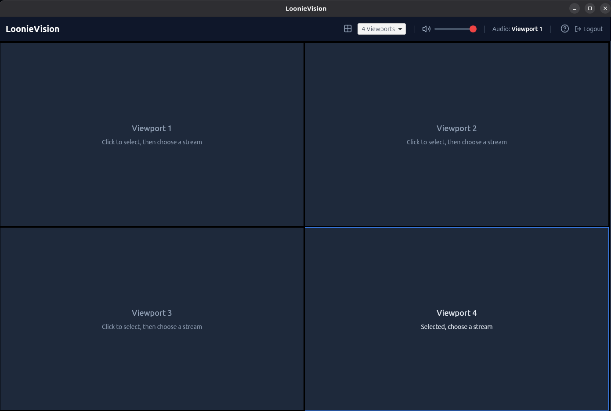

# LoonieVision

Multi-viewer desktop application for CBC GEM Olympic streams. Watch up to 4 concurrent streams or replays with seamless audio switching.

## ⚠️ Disclaimer

This is an unofficial third-party application. It is not associated in any way with CBC/Radio-Canada or their companies. LoonieVison requires a CBC account and does not help circumvent any content protection or limitations by CBC/Radio-Canada. LoonieVision is a non-commercial, fan made application looking to cheer on Canadian's Olympic athletes. All products and company names are trademarks™ or registered® trademarks of their respective holders. Any product names, logos and other trademarks or images featured within the app are the property of their respective trademark holders.

## Features

- 🎥 Watch up to 4 CBC GEM Olympic streams simultaneously
- 🔊 Individually control stream audio
- ⌨️ Keyboard shortcuts for quick control
- 🖥️ Cross-platform: Windows, macOS, Linux

## Installation

### Pre-built Binaries

Download the latest release from [GitHub Releases](../../releases).
Make sure to download the write binary for your OS.

## Usage

1. **Login:** Sign in with your CBC account when prompted **(Required)**
2. **Select Streams:** Browse the sidebar for Olympic events
3. **Assign to Viewport:** Click a stream to assign it to the selected viewport
4. **Select Video Grid Size** Select stream grid count, 1 if you want to watch one stream at a time or 2 - 4 for multiple
5. **Keyboard Shortcuts:**
   - `1-4`: Focus audio on viewport 1-4
   - `S`: Open/close stream/replay list
   - `↑↓`: Volume control
   - `Delete`: Remove stream from viewport

## Known issues

- The master volume control doesn't work on Mac OS right now
- Linux has issues with playing event replays, sometimes it works, sometimes it doesn't
- Fullscreening a video doesn't work
- Generally still needs some polish, if you find an issue, open an issue with steps to reproduce

## License

MIT License - See [LICENSE](LICENSE) for details.
